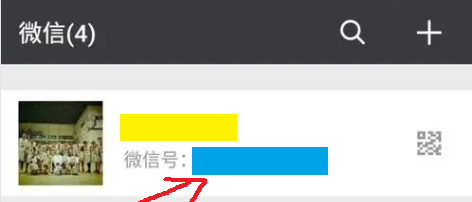

## 说明

此目录是从数据库导出并解密下一步需要的 JSON 。  
除若干字段使用 wechat 源码里面的方法解码外基本无处理  

### 使用

-   安装 node 环境 [http://lqzhgood.github.io/Shmily/guide/setup-runtime/nodejs.html]
-   从 `1 decode db` 导出 `decrypted_database.db` 复制到 `input` 下
-   修改 `config.js` 并填入需要导出的对方 `微信id`

    -   获取方式详见 __获取微信号__

-   执行 `npm run build`
-   复制 `dist`内容到 `/ToMsg/input/JSON/db-android` 目录中
     

#### 获取微信号

可以通过以下方式获取

1. 通过微信查看对方 `微信号` ，微信号可以修改，所以可能数据库中有多个

    

2. 通过数据库查看
   `export\db-android\1 decode db\ViewDB\wxsqlcipher\wxsqlcipher.exe` 打开数据库 `decrypted_database.db`

    按图搜索消息内容找到对应的 `talker`

    

### 解密

#### Message

`.\lib\decodeMessageTable`  
由于本人不懂 `java` ，所以是让别人写的 @tzh，需求也没提太多，就是导出 `message` 并解密某些字段  
会输出 `message.json`, BLOB 文件夹里面是不知道如何解析的文件,通过 Utf-8 编码写入文本. 应该需要从 buffer 16 进制去分析解码  

-   `lvbuff` 字段不知道怎么解码,仅已知下列情况可用
    -   语音通话, utf-8 解码出描述文字(通话 xx 秒)

#### FAQ

-   报错 `Java heap space` --> [issues #2](https://github.com/lqzhgood/Shmily-Get-Wechat/issues/2)
